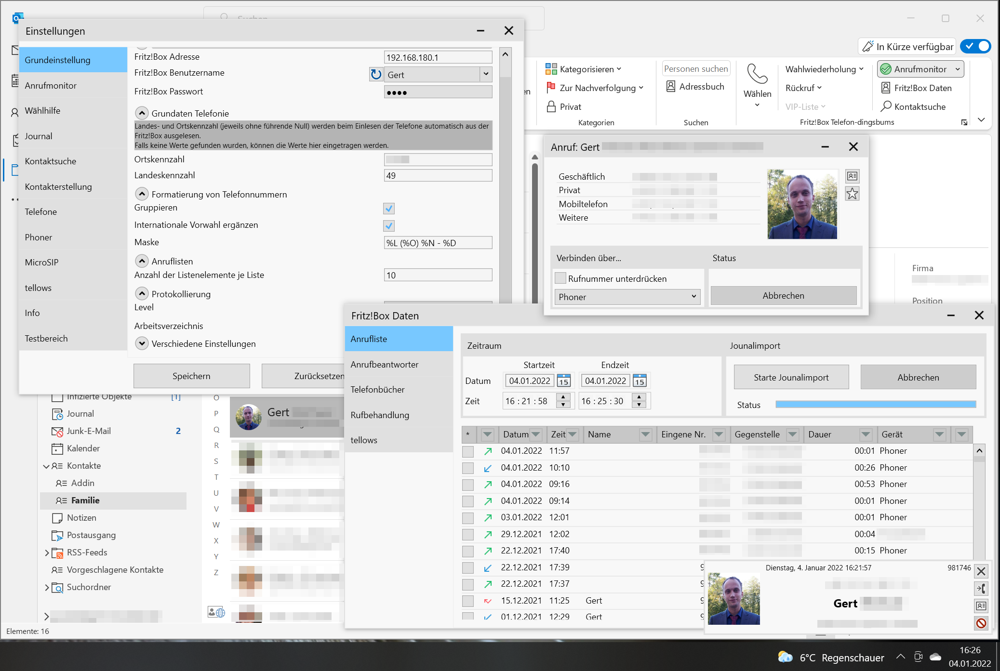

# Fritz!Box Telefon-dingsbums V5

Dieses Projekt ist ein Addin für Microsoft Outlook. 
Das Projekt ist in den ersten Versionen bereits 2006 entstanden und wurde über die Jahre von einer Makrosammlung hin zu einem Office Addin überführt.

Dieses Addin ist in meiner Freizeit entstanden. Ich erwarte keine Gegenleistung. Ein Danke ist ausreichend. Wer mir dennoch etwas Gutes zukommen lassen möchte kann dies gerne tun:

### Zielsetzung
Ziel ist es, die Produkte der Firma AVM (Fritz!Box) aus Berlin besser mit Outlook zu verknüpfen. Hierbei soll nur auf die Standardfunktionen der Fritz!Box zurückgegriffen werden,
d.h. es sind keine tiefgreifenden Modifikationen an der Fritz!Box erforderlich. 

### Funktionsumfang
#### Unterstütze Funktionen (was geht)
* [x] Starten von Telefonaten
* [x] Signalisierung eingehender Anrufer
* [x] Anzeige verfügbarer Informationen zum Gesprächspartner
* [x] Ermittlung der Kontaktdaten erfolgt verschiedenen Quellen
  * [x] Outlook Adressbüchern
  * [x] Telefonbücher der Fritz!Box
  * [x] Rückwärtssuche
  * [x] [tellows](https://tellows.de) (Es wird ein kostenpflichtiger [API Key](https://shop.tellows.de/de/tellows-api-key.html) benötigt.)
* [x] Ein- und Ausschalten der Rufumleitungen und Anrufbeantworter der Fritz!Box
* [x] Abhören, Herunterladen und Löschen von Nachrichten auf dem Anrufbeantworter
* [x] Protokollierung aller Telefonate
* [x] Signalisierung der aktuellen Gesprächsdauer (Stoppuhr)
* [x] Bearbeiten von Kontakten in den Fritz!Box Telefonbüchern
* [x] Hochladen von Outlook Kontakten zu den Fritz!Box Telefonbüchern
* [x] Bearbeiten der Fritz!Box Sperrliste
* [x] Rückruf- und Wahlwiederholungsliste
* [x] VIP-Liste für häufig anzurufende Kontakte
* [x] Anzeige verpasster Anrufe in einem Outlook Seitenfenster ([CustomTaskPane](https://docs.microsoft.com/en-us/dotnet/api/microsoft.office.tools.customtaskpane?view=vsto-2017))
* [x] Direktes Übermitteln einer anzurufenden Telefonnummer an eigige IP-Telefone via http Request (vgl. [Fernsteuermöglichkeit diverser SIP-Telefone](https://www.ip-phone-forum.de/threads/fernsteuerm%C3%B6glichkeit-diverser-sip-telefone.313272/))
  * [x] Softphone: [Phoner](https://phoner.de) (PhonerLight wird nicht unterstützt)
  * [x] SoftPhone: [MicroSIP](https://www.microsip.org/)
  * [x] Getestet: Snom
  * [x] Ungetestet (sollte funktionieren): Fanvil, Gigaset, Yealink
  * [ ] Noch nicht implementiert: Grandstream (Authentifizierungsverfahren)
  * [ ] Nicht unterstützt: Unify (Openstage) 

### Voraussetzungen
Für die Nutzung des Addins wird benötigt: 
1. eine (halbwegs) aktuelle AVM Fritz!Box mit Telefoniefunktion.
   1. Damit dieses Addin korrekt arbeiten kann, muss ein Nutzer mit Administratorrechten darauf zugreifen. 
   2. Das Loginverfahren ohne Benutzername wird seitens AVM nicht mehr unterstützt. Das heißt ab FRITZ!OS 7.25 muss ein Benutzer angegeben werden, da ansonsten die Fritz!Box jeden Zugriff verweigert. ([Info AVM](https://avm.de/fileadmin/user_upload/Global/Service/Schnittstellen/Empfehlungen%20zur%20Benutzerfu%CC%88hrung%20bei%20der%20Anmeldung%20an%20einer%20FRITZ%21Box_v1.1.pdf))
   3. Die Zweifaktor-Authentifizierung der Fritz!Box muss deaktiviert werden, damit das Wählen mit dem ausgewählten Telefon möglich ist. In der Fritz!Box muss die Option 
      `Ausführung bestimmter Einstellungen und Funktionen zusätzlich bestätigen` unter `System / FRITZ!Box - Benutzer / Anmeldung im Heimnetz` deaktiviert sein.
   4. Der Fritz!Box CallMonitor muss aktiviert sein: Hierzu den Telefoncode `#96*5*` per Telefon wählen.
   5. Zur Kommunikation mit der Fritz!Box wird u. a. die TR064-Schnittstelle verwendet. Daher darf diese nicht deaktiviert werden.
2. Microsoft Outlook (2010 bis 2021 inkl. 365)
3. [Microsoft .NET Framework 4.8](https://dotnet.microsoft.com/download/dotnet-framework/net48) und [Microsoft Visual Studio 2010 Tools for Office Runtime Redistributable (VSTO 2010)](https://www.microsoft.com/de-DE/download/details.aspx?id=48217)
   Bei der Installation wird geprüft, ob beides bereits installiert ist. Falls nicht, werden beide Komponenten heruntergeladen und installiert. **Ich empfehle jedoch, diese beiden Komponenten vorab zu installieren.**

### Links
Forum für Hilfestellungen ([IP Phone Forum](https://www.ip-phone-forum.de/)): [Fritz!Box Telefon-dingsbums (Ein MS Outlook Addin)](https://www.ip-phone-forum.de/threads/fritz-box-telefon-dingsbums-ein-ms-outlook-addin.237086/)

### Verwendete Drittanbieter-Bibliotheken​
Aktuell werden folgende Drittanbieter-Bibliotheken​ in das Addin eingebunden:
* [Dirkster.TreeLib](https://github.com/Dirkster99/TreeLib)
* [FilterDataGrid](https://github.com/macgile/DataGridFilter)
* [HttpClientFactoryLite](https://github.com/uhaciogullari/HttpClientFactoryLite)
* [MixERP.Net.VCards](https://github.com/mixerp/mixerp.net.vcards)
* [Newtonsoft.Json](https://www.newtonsoft.com/json)
* [NLog](https://nlog-project.org/)
* [PixiEditor.ColorPicker](https://github.com/PixiEditor/ColorPicker)

### Quellen
Ursprüngliche Thread von 2006 im [IP Phone Forum](https://www.ip-phone-forum.de/): [Outlook Wählhilfe (Makro) ohne Box zu modifizieren](https://www.ip-phone-forum.de/threads/outlook-w%C3%A4hlhilfe-makro-ohne-box-zu-modifizieren.102096/)

Das Addin ist nicht ohne Hilfestellung anderer Entwickler und von denen zur Verfügung gestellten Programmcode entstanden. Im folgenden werde ich Quellen auflisten, bei denen ich Codefragmente, Lösungen und Ideen entnommen habe.
Es liegt mir fern, fremden Code als meinen zu verkaufen. (Falls ich was vergessen habe, so werde ich es natürlich gerne ergänzen.)
* TCP-Client für den Anrufmonitor: ErfinderDesRades [VersuchsChat mit leistungsfähigem Server](https://www.vb-paradise.de/index.php/Thread/61948-VersuchsChat-mit-leistungsf%C3%A4higem-Server)
* WPF TreeView: Dirk Bahle [Advanced WPF TreeView in C#/VB.Net Part 6 of n](https://www.codeproject.com/Articles/1224943/Advanced-WPF-TreeView-in-Csharp-VB-Net-Part-of-n)
* WPF Telefonbuch: Tosker [ContactBook-Tutorial](https://github.com/Tosker/ContactBook-Tutorial), [WPF Contact Book - Part 1 [Getting Started]](https://www.youtube.com/watch?v=bmw68zxjwG4)
* WPF Navigation in Einstellungen: Rachel Lim [Navigation with MVVM](https://rachel53461.wordpress.com/2011/12/18/navigation-with-mvvm-2/)
* WPF RelayCommand: Nofear23m [Command's in WPF](https://www.vb-paradise.de/index.php/Thread/128963-Command-s-in-WPF/?postID=1116045#post1116045)
* WPF Enums: Brian Lagunas [BindingEnumsInWpf](https://github.com/brianlagunas/BindingEnumsInWpf), [A Better Way to Data Bind Enums in WPF](https://brianlagunas.com/a-better-way-to-data-bind-enums-in-wpf/),
  [Localize Enum Descriptions in WPF](https://brianlagunas.com/localize-enum-descriptions-in-wpf/)
* Expanded ObservableCollection: Rachel Lim [Stack Overflow: how to sort ObservableCollection](https://stackoverflow.com/a/7285548)
* WPF TimePicker: Michael Detras [Creating a WPF Custom Control](http://www.nullskull.com/a/1401/creating-a-wpf-custom-control.aspx)
* Passwortverschlüsselung: [Rijndael Encryption in VB.NET](http://www.freevbcode.com/ShowCode.asp?ID=4520)
* Routine zur Überprüfung der installierten .NET Version: Christoph Nahr [Check .NET Version with Inno Setup](http://kynosarges.org/DotNetVersion.html)
* WPF in VSTO Addins [Using WPF resource dictionary from separate assembly in Excel VSTO](https://github.com/didzispetkus/vsto-external-resource-library)
* WPF Dark Theme: AngryCarrot789 [WPFDarkTheme](https://github.com/AngryCarrot789/WPFDarkTheme)
* WPF Dark DataGrid: Chris Davis [Data Grid XAML Styling](https://gist.github.com/chrdavis/288d743362b963b875832cc493d2cc94)
* Digest Authentication: Callum Houghton [Implementing Digest Authentication in .NET](https://dev.to/callumhoughton18/implementing-digest-authentication-in-net-396j)

### Datenschutz
Es werden keine zugesendeten Informationen an mich oder Dritte weitergeben.
Angaben über das persönliche Telefonieverhalten werden weder ausgewertet noch an Dritte weitergegeben.
Das Programm übermittelt keinerlei Daten an Dritte, jedoch mit folgenden Ausnahmen:
* Bei der Rückwärtssuche wird die zu Telefonnummer an die ausgewählte Suchmaschine übergeben. Die Datenschutzhinweise der Suchmaschinen sind zu beachten!
* Bei der Nutzung von [tellows](https://tellows.de) wird die eingehende Nummer an den Anbieter übermittelt. Die Datenschutzhinweise von tellows sind zu beachten!
* Bei der Nutzung von IP-Telefonen (einschl. [Phoner](https://phoner.de) und [MicroSIP](https://www.microsip.org/)) werden die zu wählenden Nummern an die Telefone übergeben. Die Datenschutzhinweise der Telefone bzw. der Softphones sind zu beachten!

### Markenrecht
Dieses Outlook-Addin wird vom Autor privat in der Freizeit als Hobby gepflegt. Mit der Bereitstellung des Outlook-Addins werden keine gewerblichen Interessen verfolgt. Es wird aus rein ideellen Gründen zum Gemeinwohl aller Nutzer einer Fritz!Box betrieben. 
Die Erstellung dieser Software erfolgt nicht im Auftrag oder mit Wissen der Firmen AVM GmbH bzw. Microsoft Corporation. Diese Software wurde unabhängig erstellt. Der Autor pflegt im Zusammenhang mit dieser Software keine Beziehungen zur Firma AVM GmbH oder Microsoft Corporation.
